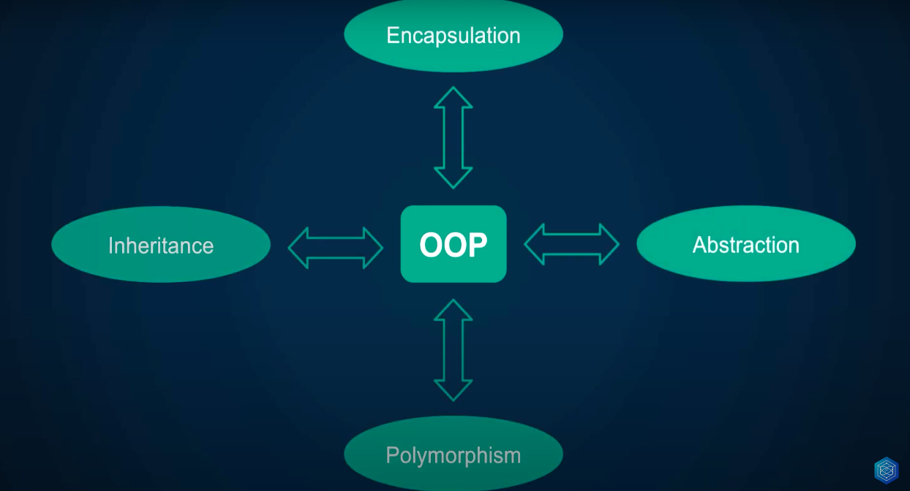
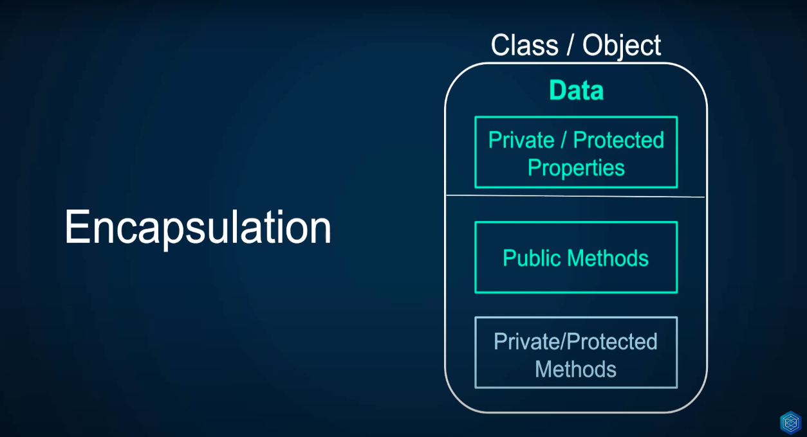

# Encapsulation & abstraction

These examples begin to explore the main principles of object-oriented programming:

- encapsulation
- Abstraction
- Inheritance
- Polymorphism

[Video lesson](https://www.youtube.com/watch?v=kA9BTNPFObo&list=PLr3d3QYzkw2xabQRUpcZ_IBk9W50M9pe-&index=42)

## Encapsulation

**Hides the internal state of the object**

In Object Oriented Programming (OOP), encapsulation refers to the grouping of data with the methods that operate on that data, or the restriction of direct access to some of the components of an object.1 Encapsulation is used to hiding the values ​​or state of a structured data object within a class, preventing direct access to them by clients in a way that could expose hidden Implementation details or violate state invariance maintained by methods.

[Spanish Documentation](<https://es.wikipedia.org/wiki/Encapsulamiento_(inform%C3%A1tica)>)

## Abstraction

**Hides the internal implementation**

In object-oriented programming theory, abstraction involves the facility to define objects that represent abstract "actors" that can perform work, report on and change their state, and "communicate" with other objects in the system. The term encapsulation refers to the hiding of state details, but extending the concept of data type from earlier programming languages to associate behavior most strongly with the data, and standardizing the way that different data types interact, is the beginning of abstraction. When abstraction proceeds into the operations defined, enabling objects of different types to be substituted, it is called polymorphism. When it proceeds in the opposite direction, inside the types or classes, structuring them to simplify a complex set of relationships, it is called delegation or inheritance.

[Documentation](<https://en.wikipedia.org/wiki/Abstraction_(computer_science)#Abstraction_in_object_oriented_programming>)
