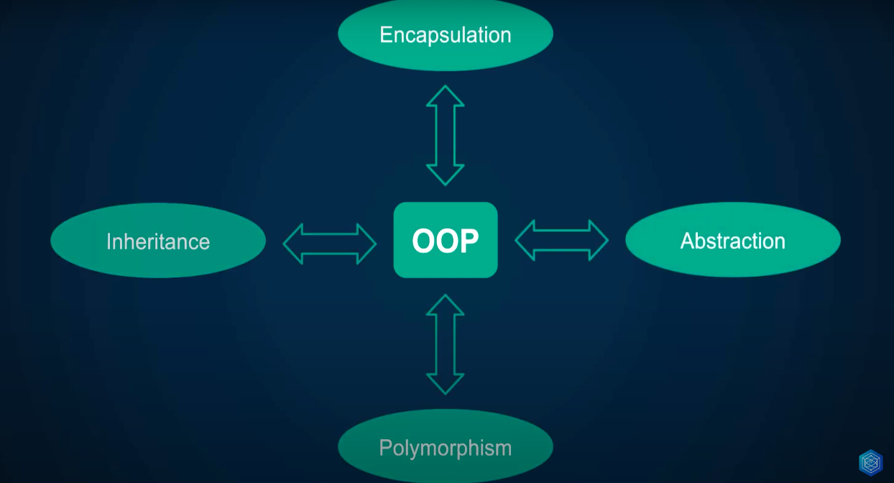
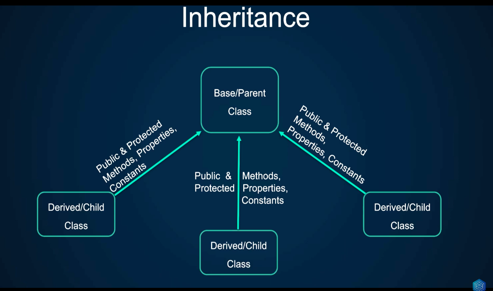
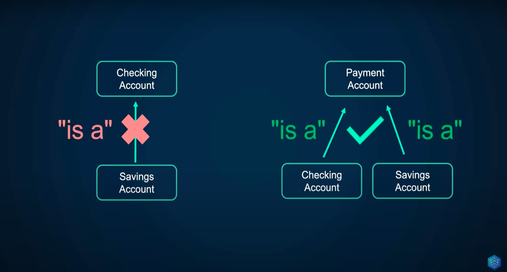
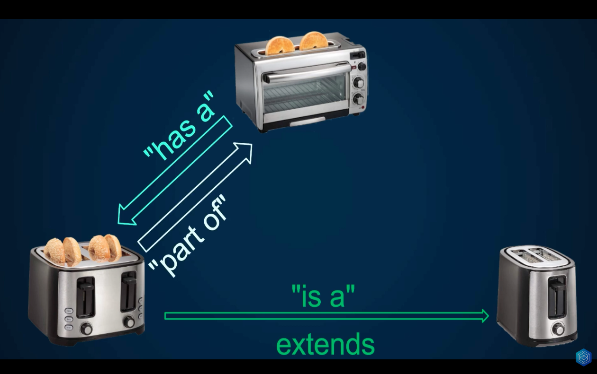

# Encapsulation & abstraction

These examples begin to explore the main principles of object-oriented programming:

- encapsulation
- Abstraction
- Inheritance
- Polymorphism

[Video lesson](https://www.youtube.com/watch?v=LyyzeYOoH5s&list=PLr3d3QYzkw2xabQRUpcZ_IBk9W50M9pe-&index=43)

## Inheritance

**Extendes the base class functionality**

In Object Oriented Programming (OOP), encapsulation refers to the grouping of data with the methods that operate on that data, or the restriction of direct access to some of the components of an object.1 Encapsulation is used to hiding the values ​​or state of a structured data object within a class, preventing direct access to them by clients in a way that could expose hidden Implementation details or violate state invariance maintained by methods.

[Documentation](https://learn.microsoft.com/en-us/dotnet/csharp/fundamentals/object-oriented/inheritance)

To determine if a class can extend another, you can check if it is essentially an extension of the class, if it IS NOT, it is better not to extend it.

In many cases, such as the one shown in the following graphic, it is better to use composition than inheritance. **Design should always privilege composition over inheritance.**

