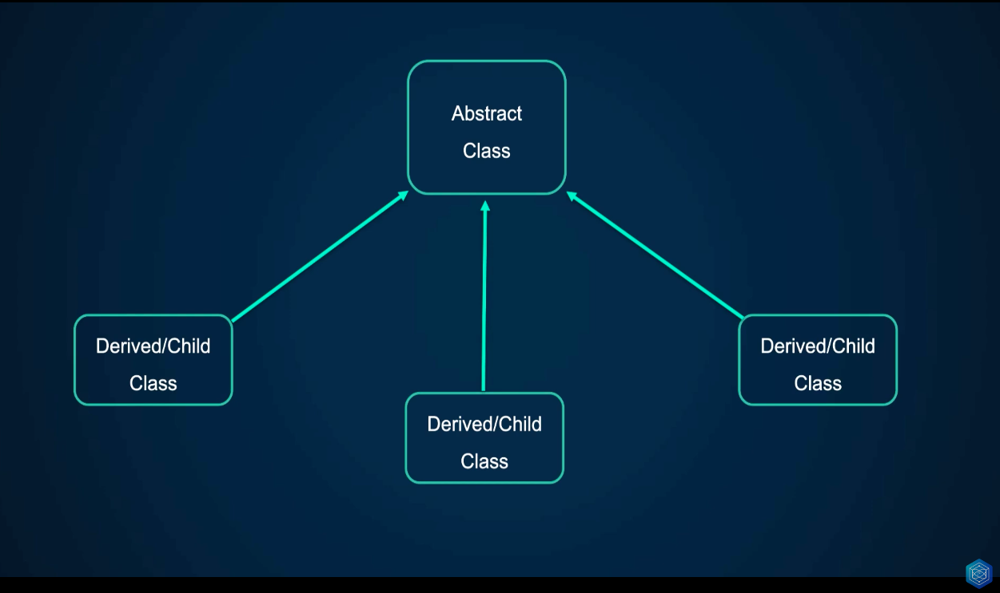
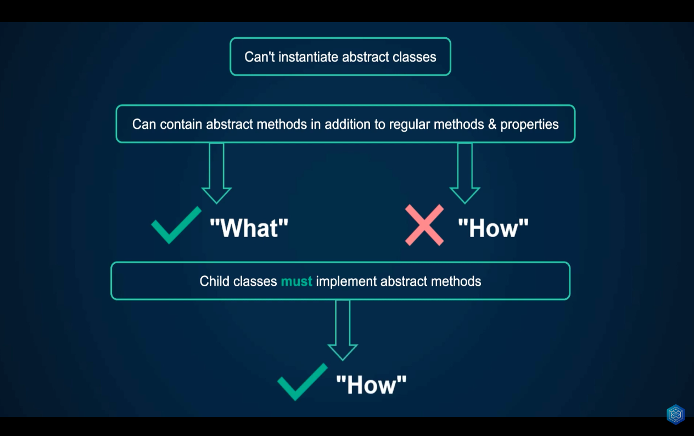
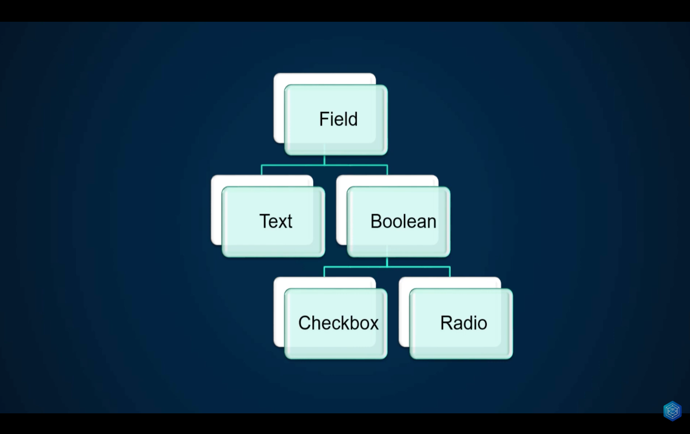

# Abstract Class

To begin to understand the principle of Polymorphism it is necessary to understand abstract classes. The abstract classes are like the template that will later be used by the classes derived or children of it.

[Video lesson](https://www.youtube.com/watch?v=UnwaW13xJuw&list=PLr3d3QYzkw2xabQRUpcZ_IBk9W50M9pe-&index=44)

## Abstract Class Rules

1. They cannot be instantiated, they can only be extended, so it is not possible to create objects from the abstract class.
2. You can have abstract methods in company with regular methods and properties. The abstract class knows the 'what' but does not know the 'how'
3. All child classes of an abstract class must implement its abstract methods.

## Applications

Abstract classes should be implemented when you want to force the implementation of some methods defined in it and in turn have some basic functionality available that will be inherited.

_If the abstract class only has abstract methods it is better to use an interface instead._

### Implementation example

The files describe the implementation of an abstract class following the following HTML tag pattern, where 'Field' and 'Boolean' are abstract classes.

