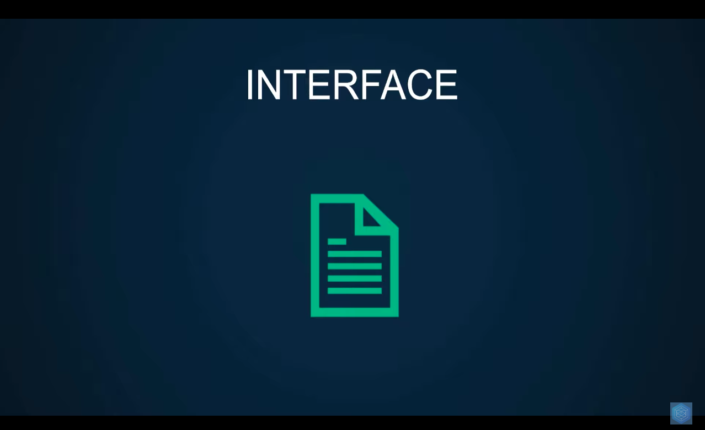
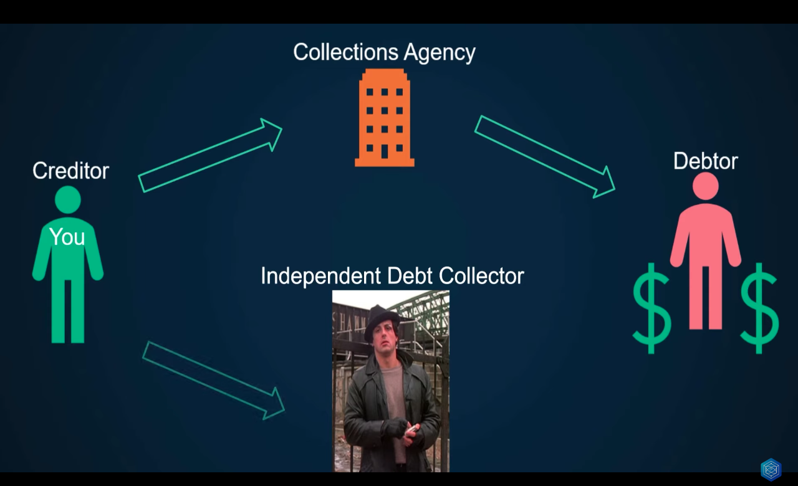
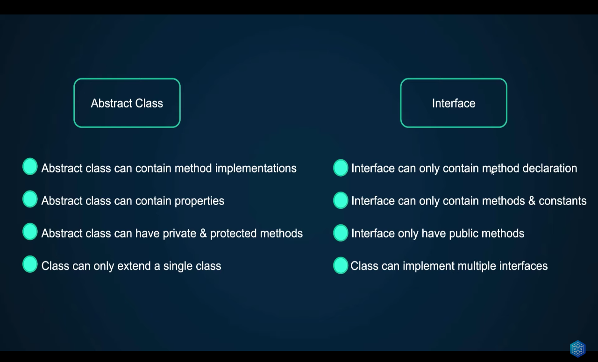
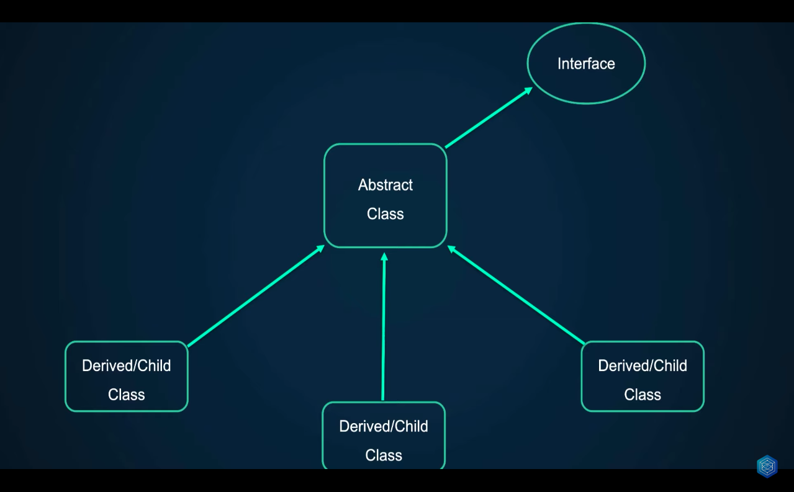

# Inheritance

These examples begin to explore the main principles of object-oriented programming:

- Encapsulation
- Abstraction
- Inheritance
- **Polymorphism**

[Video lesson](https://www.youtube.com/watch?v=-AJic0FjuAA&list=PLr3d3QYzkw2xabQRUpcZ_IBk9W50M9pe-&index=45)

## Polymorphism

**It can take many forms**

In programming language theory and type theory, polymorphism is the provision of a single interface to entities of different types or the use of a single symbol to represent multiple different types. The concept is borrowed from a principle in biology where an organism or species can have many different forms or stages.

[Documentation](<https://en.wikipedia.org/wiki/Polymorphism_(computer_science)>)

### Interface

_The central question when declaring an interface is whether my class can have multiple implementations, if the answer is yes, then an interface is convenient_

Object interfaces allow you to create code which specifies which methods a class must implement, without having to define how these methods are implemented. Interfaces share a namespace with classes and traits, so they may not use the same name.

Interfaces are defined in the same way as a class, but with the interface keyword replacing the class keyword and without any of the methods having their contents defined.

All methods declared in an interface must be public; this is the nature of an interface.

In practice, interfaces serve two complementary purposes:

To allow developers to create objects of different classes that may be used interchangeably because they implement the same interface or interfaces. A common example is multiple database access services, multiple payment gateways, or different caching strategies. Different implementations may be swapped out without requiring any changes to the code that uses them.

To allow a function or method to accept and operate on a parameter that conforms to an interface, while not caring what else the object may do or how it is implemented. These interfaces are often named like Iterable, Cacheable, Renderable, or so on to describe the significance of the behavior.

Interfaces may define magic methods to require implementing classes to implement those methods.

[Documentation](https://www.php.net/manual/en/language.oop5.interfaces.php)

#### Interfaces are contracts where the implementation does not matter

#### Differences between interfaces and abstract classes

It is possible for an abstract class to implement an interface

